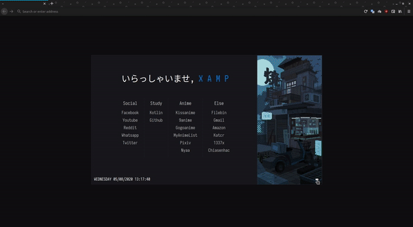

Startpage
========

<h3>Live Demo: <a href="http://BeakBryno7.github.io/startpage/">Demo</a> </h3>

<h3>Default Home</h3>

<h3>Preview</h3>

This is a fork of RamenMaestro's [startpage](https://github.com/RamenMaestro/startpage) with a image scroll option and larger option size.
